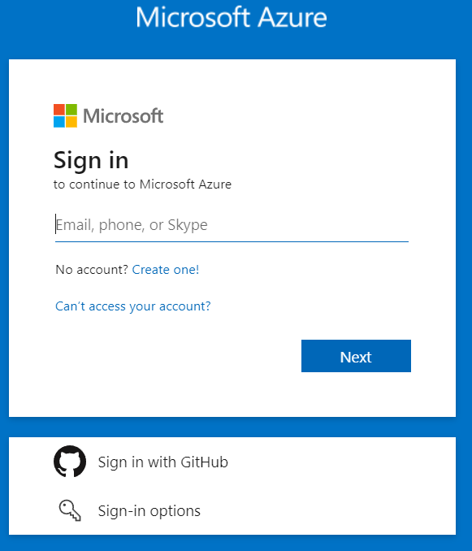
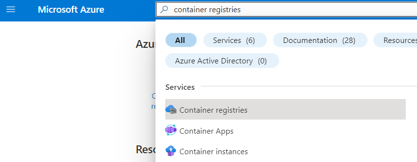
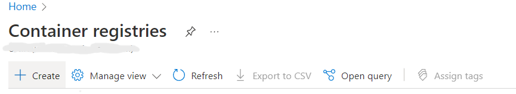
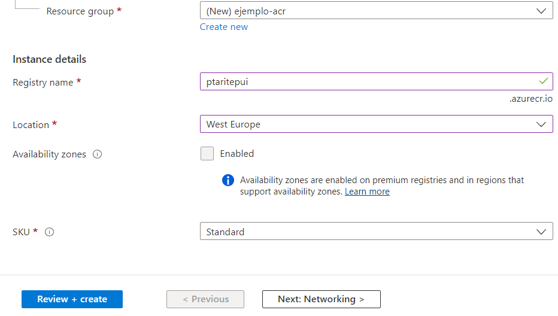
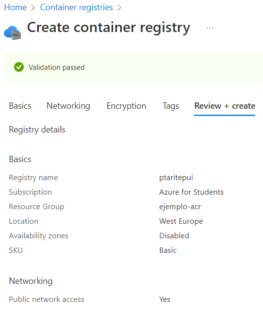
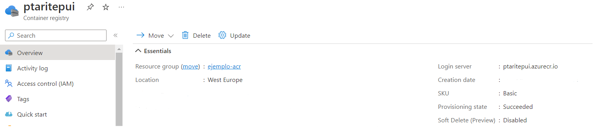
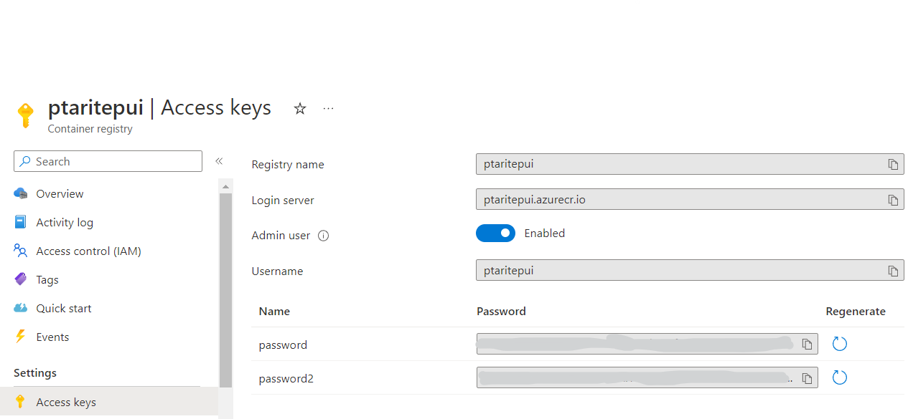
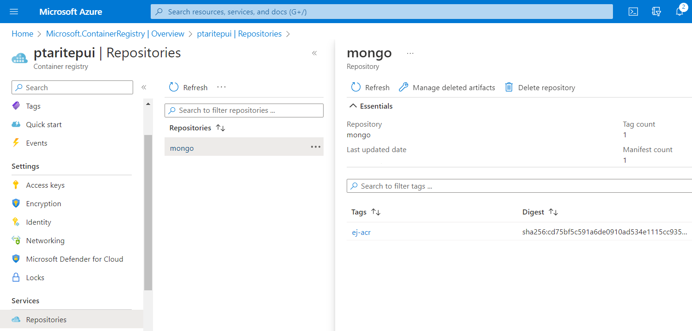
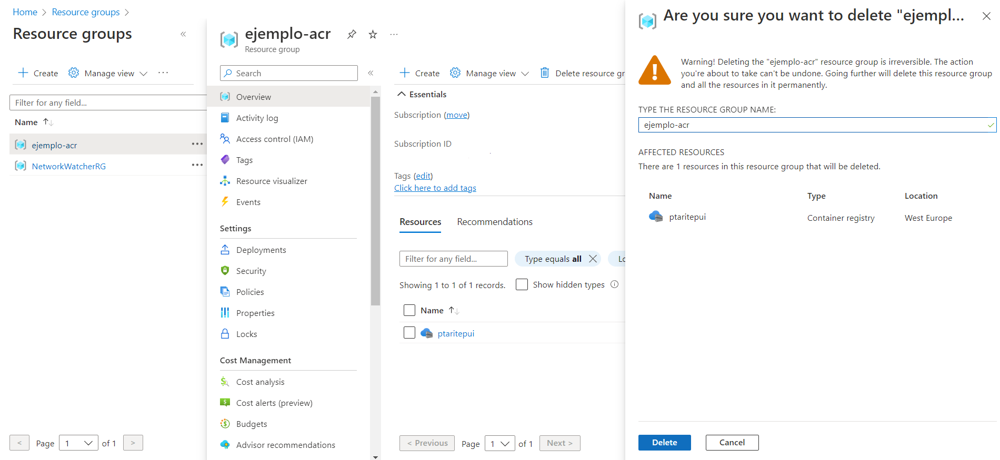

# Creación de un repositorio de imágenes de contenedor desde el Portal de Azure

En este ejemplo se creará un repositorio de imágenes de contenedor con las siguientes características:

* Grupo de Recursos: ejemplo-acr
* Nombre: ptaritepui
* Region: West Europe
* SKU: Standard

## Procedimiento

1. Ir al portal de Azure https://portal.azure.com 

Autenticarse con las credenciales asociadas a la suscripción de Azure.

<p align="center">
  
</p>

2. Una vez dentro del portal, ir al buscador superior e introducir el nombre del servicio **Container Registries**

<p align="center">
  
</p>

3. Crear un nuevo **Container Registry** seleccionando la opción **Create**

<p align="center">
  
</p>

4. Cumplimentar el formulario con los datos indicados arriba:

<p align="center">
  
</p>

5. Finalizar presionando el botón **Review+Create** para comprobar que todos los datos introducidos son los adecuados.

<p align="center">
  
</p>

6. Comprobar que el ACR se ha desplegado correctamente.

<p align="center">
  
</p>

7. Habilitar la autenticación por password para el administrador.

<p align="center">
  
</p>

---

<p align="center">
  
</p>

8. Probar la autenticación en el ACR

Desde una terminal con **docker** o **podman** instalado autenticarse en el ACR. El siguiente ejemplo aplica para Linux utilizando las credenciales del administrador del acr mostradas arriba:

```
REGISTRY=ptaritepui.azurecr.io
podman login ${REGISTRY}
Username: ptaritepui
Password: *********
```

Deberá mostrarse el siguiente mensaje:

```
Login Succeeded!
```

9. Subir una imagen pública de **mongodb** al ACR:

9.1 Descargar la imagen mongodb desde Docker Hub:

```
$ podman pull docker.io/mongo
Trying to pull docker.io/library/mongo:latest...
Getting image source signatures
Copying blob 96d33bf42f45 done
Copying blob 846c0b181fff done
Copying blob ef773e84b43a done
Copying blob 2bfad1efb664 done
Copying blob 84e59a6d63c9 done
Copying blob d2f00ac700e0 done
Copying blob ebaa69d77b61 done
Copying blob f4af9408cbac done
Copying blob 70f9fc9ff713 done
Copying config 32c5c1d795 done
Writing manifest to image destination
Storing signatures
32c5c1d795d9ccdffaff903dbd83059d11a1941a57ec81ae148e283607f0a8a4
```

9.1 Etiquetar la imagen con la **TAG** `ptaritepui.azurecr.io/mongo:ej-acr`

```
$ podman tag docker.io/library/mongo:latest ptaritepui.azurecr.io/mongo:ej-acr
```

9.2 Subir la imagen etiquetada al ACR:

```
$ podman push ptaritepui.azurecr.io/mongo:ej-acr
Getting image source signatures
Copying blob 9a423e14531b skipped: already exists
Copying blob 8789df14e8a2 skipped: already exists
Copying blob 78f79d3711f7 skipped: already exists
Copying blob df374a1a2246 skipped: already exists
Copying blob 0241885f3970 skipped: already exists
Copying blob fdd8a5326cd4 skipped: already exists
Copying blob 81c45ae6f4cb done
Copying blob a0b1f3f59b6a skipped: already exists
Copying blob 22089df85bb7 skipped: already exists
Copying config 32c5c1d795 done
Writing manifest to image destination
Storing signatures
```

9.3 Comprobar desde el Portal de Azure que la imagen ya está disponible en el ACR

<p align="center">
  
</p>

10. Eliminar todos los recursos creados durante la ejecución de este ejemplo

<p align="center">
  
</p>