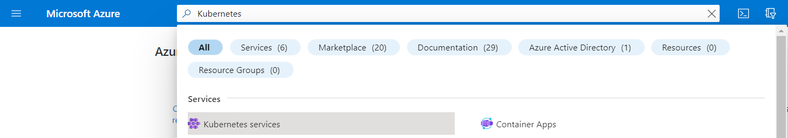
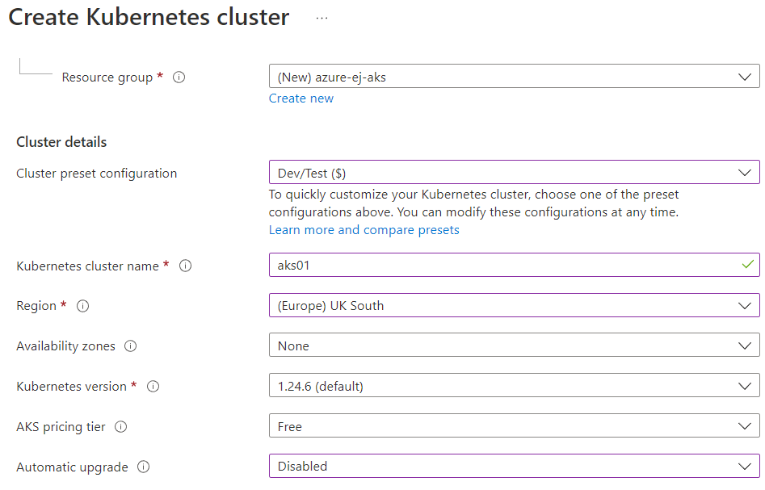
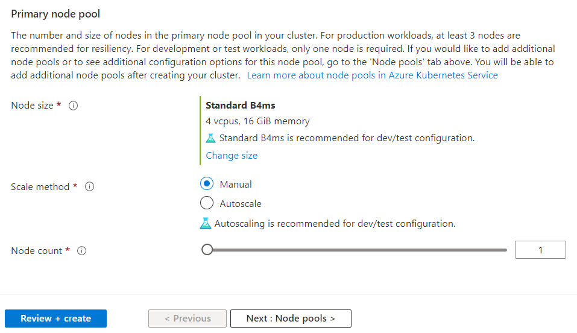
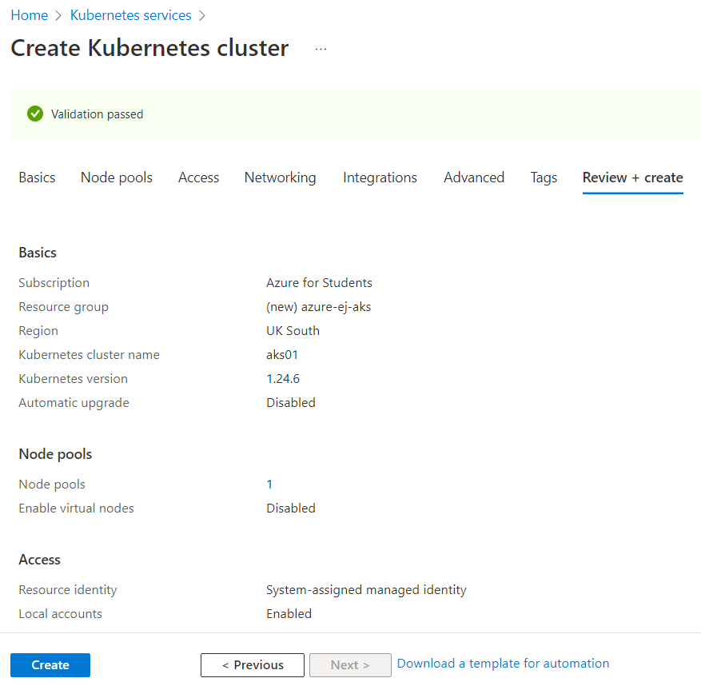
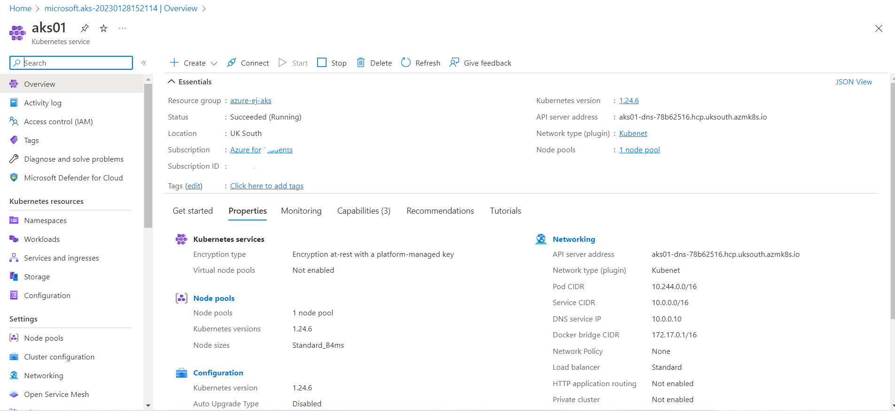
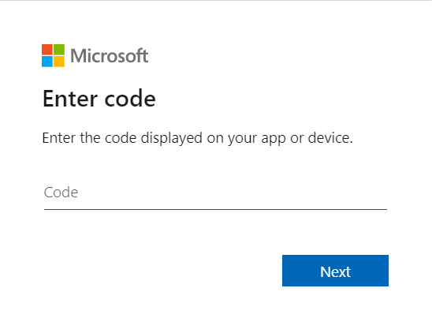
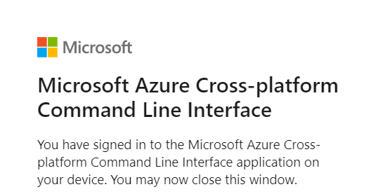

# Creación de un cluster de AKS desde el Portal de Azure

En este ejemplo se creará una máquina virtual con las siguientes características:

* Grupo de Recursos: azure-ej-aks
* Configuración predefinida del cluster: Dev/Test
* Nombre del cluster: aks01
* Region: UK-South
* Zona de Disponibilidad: None
* Versión de Kubernetes: default
* AKS Pricing Tier: Free
* Actualización automática: Manual
* Tamaño de nodos: Standard_B4ms (4 vCPUs - 16 GiB de memmoria)
* Cantidad de nodos: 1

## Procedimiento

1. Ir al portal de Azure https://portal.azure.com 

Autenticarse con las credenciales asociadas a la suscripción de Azure.

<p align="center">
  
</p>

Tras completar la autenticación estaremos dentro de la consola:

<p align="center">
  
</p>

2. Una vez dentro del portal, ir al buscador superior e introducir el nombre del servicio **Kubernetes Services**

<p align="center">
  
</p>

3. En el servicio **Kubernetes Services** seleccionar la opción **Create a Kubernetes Cluster**

<p align="center">
  
</p>

4. Cumplimentar el formulario con los parámetros indicados arriba y finalizar presionando el botón **Review+Create**. A continuación se muestran las opciones definidas para este ejemplo:

<p align="center">
  
</p>

---

<p align="center">
  
</p>

6. Comprobar que las validaciones se han realizado correctamente y presionar el botón **Create**

<p align="center">
  
</p>

7. Monitorizar el progreso de despliegue que tardará 4 minutos aproximadamente

<p align="center">
  
</p>

8. Tras finalizar el despliegue seleccionar la opción **Go to Resource** donde se podrán visualizar los parámetros del cluster recientemente creado

<p align="center">
  
</p>

9. Desde un terminal con AZ CLI previamente instalado realizar el proceso de autenticación en Azure.

```
$ az login
To sign in, use a web browser to open the page https://microsoft.com/devicelogin and enter the code ******* to authenticate.
```

9.1 Abrir un navegador web, luego ir a la URL https://microsoft.com/devicelogin e introducir el código indicado en la salida del comando `az login`


<p align="center">
  
</p>

---

<p align="center">
  
</p>

9.2 Volver a la terminal y consultar el resultado del proceso de autenticación que mostrará los siguientes datos:

```
[
  {
    "cloudName": "AzureCloud",
    "homeTenantId": "<TENANT_ID>",
    "id": "<UUID>",
    "isDefault": true,
    "managedByTenants": [],
    "name": "<SUBSCRIPTION_NAME>",
    "state": "Enabled",
    "tenantId": "<TENANT_ID>",
    "user": {
      "name": "<EMAIL>",
      "type": "user"
    }
  }
]
```

10. Obtener las credenciales del cluster de AKS mediante el AZ CLI desde la terminal

```
CLUSTER=aks01
RESOURCEGROUP=azure-ej-aks
$ az aks get-credentials --overwrite-existing --name ${CLUSTER} --resource-group ${RESOURCEGROUP}
 ```

 El comando anterior devolverá el siguiente mensaje:

 ```
 Merged "aks01" as current context in /home/admin/.kube/config
```

Ya es posible utilizar el cliente **kubectl** para realizar operaciones sobre el cluster de AKS. Por ejemplo para consultar el estado de los nodos del cluster:

```
$ kubectl get nodes
NAME                                STATUS   ROLES   AGE     VERSION
aks-agentpool-26758932-vmss000000   Ready    agent   5h37m   v1.24.6
```