# Creación de una máquina virtual desde el Portal de Azure

En este ejemplo se creará una máquina virtual con las siguientes características:

* Grupo de Recursos: azure-ej-1
* Nombre: vm01
* Region: UK-South
* Opciones de Disponibilidad: Zona de Disponibilidad
* Zona de Disponibilidad: Zones 1
* Sistema Operativo: AlmaLinux 8.5
* Tamaño: Standard_B1s (1 vCPU - 1 GiB de memmoria)
* Usuario administrador: azureuser
* Clave SSH: Generar una nueva con el nombre key-ej-1

## Procedimiento

1. Ir al portal de Azure https://portal.azure.com 

Autenticarse con las credenciales asociadas a la suscripción de Azure.

<p align="center">
  
</p>

Tras completar la autenticación estaremos dentro de la consola:

<p align="center">
  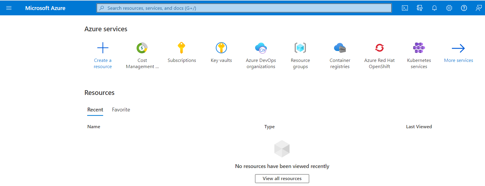
</p>

2. Una vez dentro del portal, ir al buscador superior e introducir el nombre del servicio **Virtual Machines**

<p align="center">
  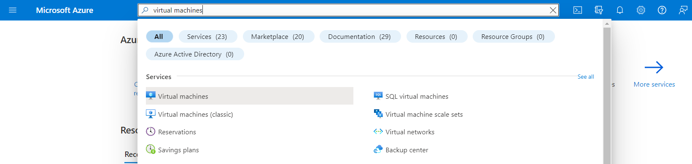
</p>

3. En el servicio **Virtual Machines** seleccionar la opción **Azure Virtual Machine**

<p align="center">
  
</p>

4. En el formulario de creación de la máquina virtual indicar un nuevo Grupo de Recursos (Resource Group) para esta nueva máquina virtual. Para este ejemplo el Grupo de Recursos se llamará **azure-ej-1**

<p align="center">
  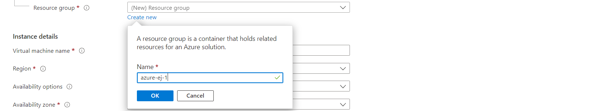
</p>

5. Cumplimentar el resto del formulario y finalizar presionando el botón **Review+Create**. A continuación se muestran las opciones definidas para este ejemplo:

<p align="center">
  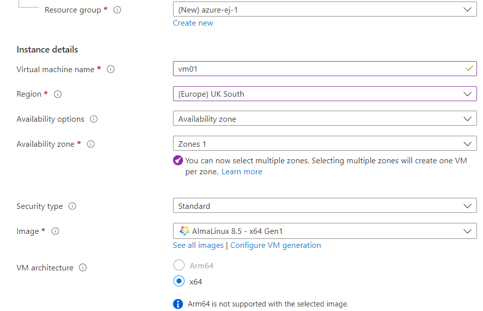
</p>

---

<p align="center">
  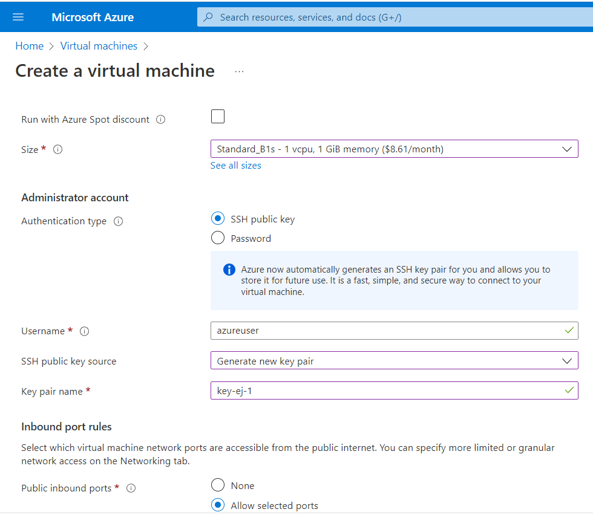
</p>

---

<p align="center">
  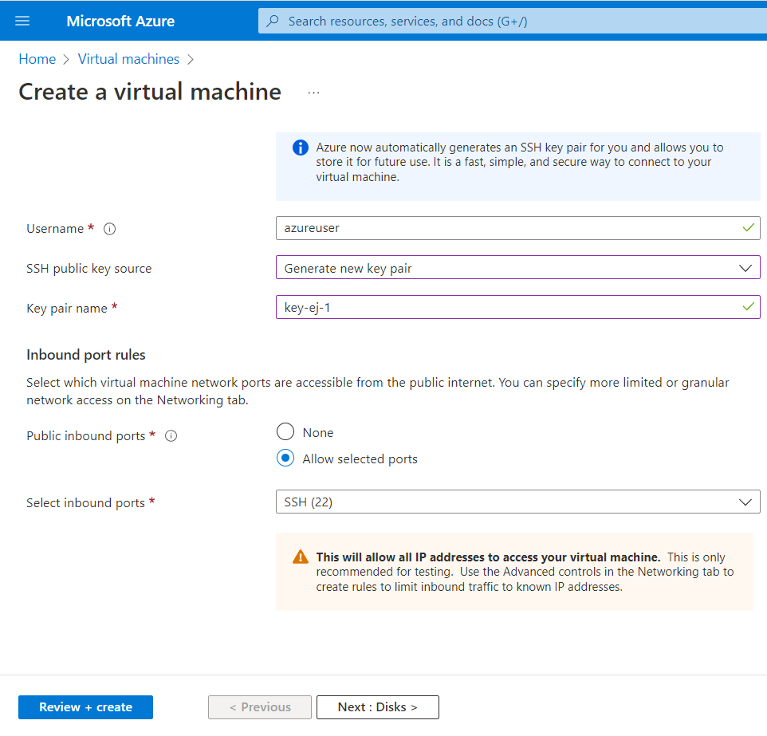
</p>

6. Comprobar que las validaciones se han realizado correctamente

<p align="center">
  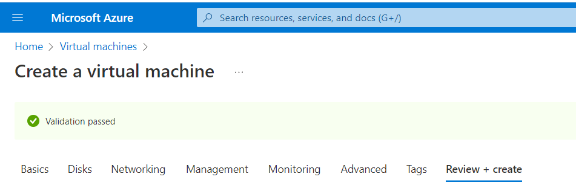
</p>

7. Al tratarse de una nueva clave SSH generada bajo demanda, será necesario descargar la nueva clave generada

<p align="center">
  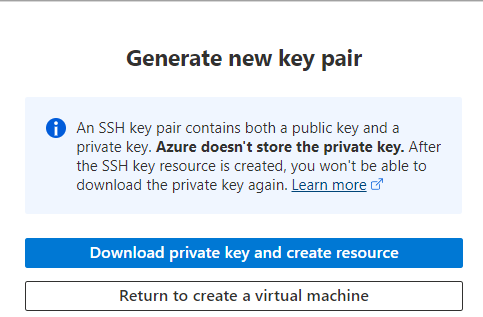
</p>

8. A continuación Azure mostrará el progreso de la creación de la máquina virtual y los recursos asociados a ésta

<p align="center">
  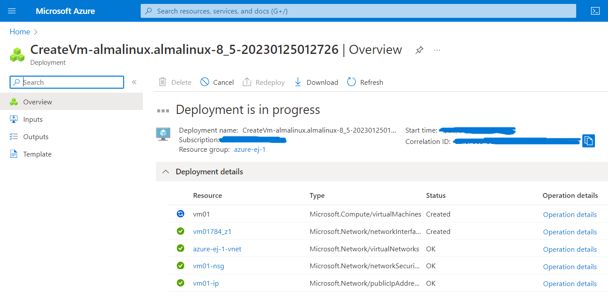
</p>

---

<p align="center">
  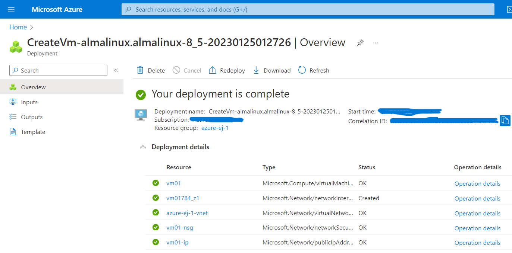
</p>

En resumen son 7 recursos:

* La propia máquina virtual.
* La subred virtual (vnet) donde se encuentra conectada la máquina virtual.
* La interfaz virtual (vnic) que utilizará la máquina virtual.
* El grupo de seguridad de red (nsg) para permitir o restringir determinado tráfico.
* La IP pública (pip) asociada a la máquina virtual para recibir tráfico desde el exterior de Azure.
* Un disco virtual (vdisk) asociado a la máquina virtual.
* Una clave SSH para la conexión a la máquina virtual.

Todos los recursos anteriores estarán creados dentro del grupo de recursos **azure-ej-1**, facilitándo así su administración.

10. Verificar la conexión SSH a la máquina virtual

```
Using username "azureuser".
Authenticating with public key "imported-openssh-key"
Activate the web console with: systemctl enable --now cockpit.socket

[azureuser@vm01 ~]$ hostnamectl
   Static hostname: vm01
         Icon name: computer-vm
           Chassis: vm
        Machine ID: f702dfd08eea4161a91caf1c75cc66d7
           Boot ID: c92be01844ca47f2bb568dff7a0318c8
    Virtualization: microsoft
  Operating System: AlmaLinux 8.5 (Arctic Sphynx)
       CPE OS Name: cpe:/o:almalinux:almalinux:8::baseos
            Kernel: Linux 4.18.0-348.20.1.el8_5.x86_64
      Architecture: x86-64
```

11. Para eliminar todos los recursos, bastaría con eliminar el grupo de recursos **azure-ej-1** tal como se indica a continuación:

Desde la vista de **Resource Groups** se selecciona el grupo **azure-ej-1**:

<p align="center">
  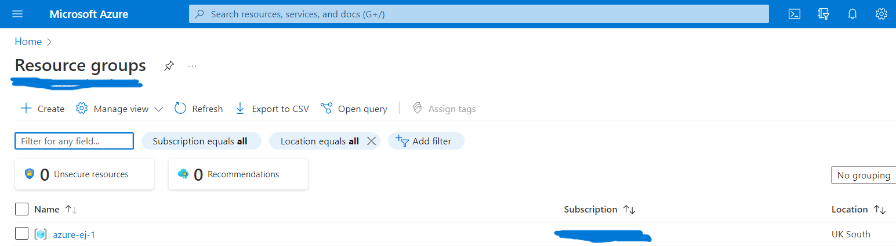
</p>

---

En la barra superior se hace clic en la opción **Delete resource group** y se confirma la eliminación escribiendo el nombre del grupo de recurso. En este caso **azure-ej-1**

<p align="center">
  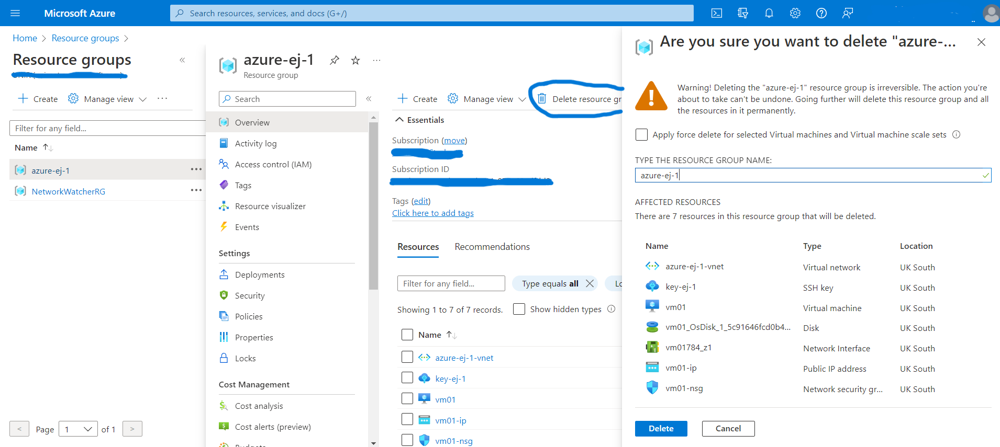
</p>