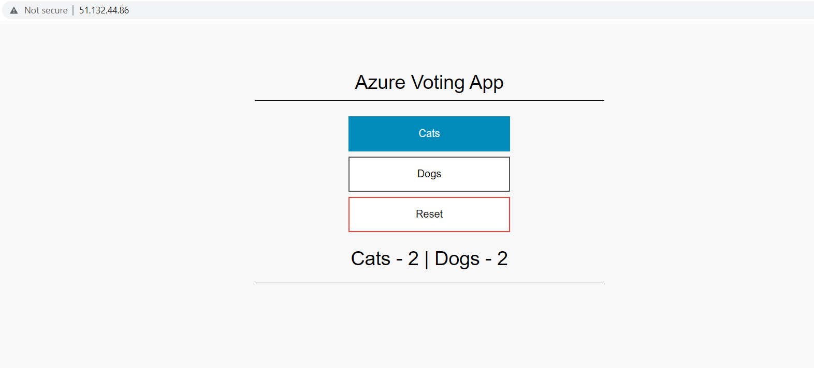

# Introducción a Helm

Este repositorio incluye una serie de ejemplos introductorios al gestor de paquetes en Kubernetes: Helm.

## Instalación de Helm

```
curl https://raw.githubusercontent.com/helm/helm/main/scripts/get-helm-3 | bash
```

El comando anterior instalará el binario de Helm bajo **/usr/local/bin/helm**.

Para comprobar la version instalada ejecutar el comando:

```
helm version
```

```
version.BuildInfo{Version:"v3.9.4", GitCommit:"dbc6d8e20fe1d58d50e6ed30f09a04a77e4c68db", GitTreeState:"clean", GoVersion:"go1.17.13"}
```

## Uso de Helm Charts

En el siguiente ejemplo definiremos un Chart de Helm para deplegar la aplicación [azure-vote](https://github.com/Azure-Samples/azure-voting-app-redis). Esta aplicación está compuesta de 2 ***Deployments*** y dos ***Services*** de Kubernetes.

A continuación el procedimiento:

1. Consultar los namespaces actuales del cluster de Kubernetes

```
kubectl get namespaces
```

```
NAME              STATUS   AGE
default           Active   39m
kube-node-lease   Active   39m
kube-public       Active   39m
kube-system       Active   39m
```
2. Crear la estructura del nuevo chart llamado azure-vote:

```
helm create azure-vote
```

El comando anterior generará la siguiente estructura:

```
azure-vote/
├── charts
├── Chart.yaml
├── templates
│   ├── deployment.yaml
│   ├── _helpers.tpl
│   ├── hpa.yaml
│   ├── ingress.yaml
│   ├── NOTES.txt
│   ├── serviceaccount.yaml
│   ├── service.yaml
│   └── tests
│       └── test-connection.yaml
└── values.yaml

3 directories, 10 files
```

3. Del subdirectorio templates sólo se debe mantener el fichero **_helpers.tpl**. El resto de ficheros se deben eliminar para este ejemplo:

```
path=azure-vote/templates
rm -rf ${path}/*.yaml
rm -rf ${path}/tests
```

4. Se modifican los parámetros del fichero [Chart.yaml](azure-vote/Chart.yaml)

5. Se crean dos subdirectorios bajo **templates**: **azure_vote_front** y **azure_front_back** correspondientes a cada aplicación a desplegar

```
mkdir azure-vote-{front,back}
```

6. Se define las plantillas para cada componente:

* [Deployment](azure-vote/templates/azure_vote_front/deployment.yaml) de **azure_vote_front**
* [Deployment](azure-vote/templates/azure_vote_back/deployment.yaml) de **azure_vote_back**
* [Service](azure-vote/templates/azure_vote_front/service.yaml) de **azure_vote_front**
* [Service](azure-vote/templates/azure_vote_back/service.yaml) de **azure_vote_back**

7. Se modifica el fichero [_helpers.tpl](azure-vote/templates/_helpers.tpl) para incluir ambos componentes: **azure_vote_front** y **azure_vote_back**

8. Se modifica el fichero [values.yaml](azure-vote/values.yaml) con los valores correspondientes a cada componente de la aplicación.

9. Se instala la aplicación mediante helm:


```
helm install azure-vote ./azure-vote
```

---
**NOTE**

Para desplegar la aplicación en un ***namespace*** específico es necesario incluir la opción `--namespace` seguida del nombre del namespace.

Por ejemplo, para desplegar la aplicación en el *namespace* **ejemplo-helm**:
```
helm install azure-vote ./azure-vote --namespace ejemplo-helm --create-namespace
```
---


10. Se comprueba que la aplicación se ha desplegado correctamente:

```
kubectl get pods
```

Se pueden observar ambos pods correspondientes a cada uno de los compontentes:

```
NAME                                READY   STATUS    RESTARTS   AGE
azure-vote-back-69ff7bc759-gn58c    1/1     Running   0          32s
azure-vote-front-5b8d46ff56-7v4j9   1/1     Running   0          32s
```

```
kubectl get svc 
```

Se pueden observar ambos servicios, siendo el azure-vote-front el único accesible desde el exterior:

```
NAME               TYPE           CLUSTER-IP     EXTERNAL-IP   PORT(S)        AGE
azure-vote-back    ClusterIP      10.0.171.186   <none>        6379/TCP       25s
azure-vote-front   LoadBalancer   10.0.176.1     51.11.1.81    80:31443/TCP   25s
```

11. Desde un navegador podemos acceder a la aplicación con la **EXTERNAL-IP** de **azure-vote-front** que ha devuelto el comando anterior.



12. Por último para generar un **tgz** del chart se debe ejecutar el siguiente comando:

```
helm package azure-vote/
```
